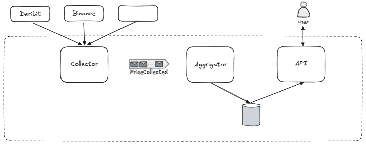
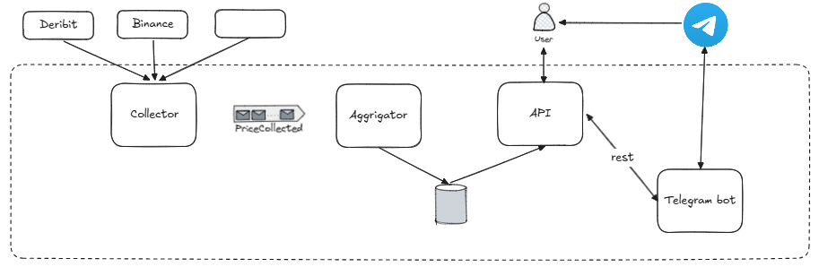

# Project Roadmap

## v0.1 — Environment Setup

### Goal

Set up the working environment and provide a minimal application startup flow.

### Acceptance Criteria

* [ ] The API starts successfully.
* [ ] `GET /health` returns `200 OK`.
* [ ] `GET /metrics` returns metrics in Prometheus format.
* [ ] The API writes structured logs to `stdout`.
* [ ] The following commands pass without errors:

  * [ ] `pytest`
  * [ ] `ruff check .`
  * [ ] `mypy --explicit-package-bases src`
* [ ] The startup flow is documented in `README.md`.

---

## v1.0 — Minimal Vertical Slice

### Goal

Set up price collection from external sources and expose the current price data through the API.

### Acceptance Criteria

* [ ] Prices are collected from the following sources:

  * [ ] DERIBIT
  * [ ] BINANCE
* [ ] A collected price event is published to Kafka.
* [ ] Structured logging and minimal metrics are configured for the whole pipeline.
* [ ] `GET /tickers` returns the list of tickers supported by the system.
* [ ] `GET /tickers/{TICKER}` returns the current price information for the selected ticker.

### Architecture

---

## v2.0 — Telegram Integration

### Goal

Add Telegram integration to the system.

### Acceptance Criteria

* [ ] A user can receive the current ticker price through Telegram.
* [ ] The Telegram bot uses data collected by the system.
* [ ] Logging and minimal metrics are configured for the Telegram component.
* [ ] Telegram interaction errors are logged correctly.
* [ ] The Telegram integration startup flow is documented in `README.md`.

### Architecture

